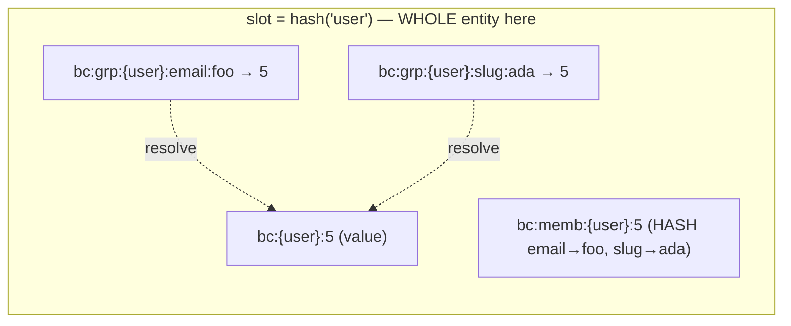
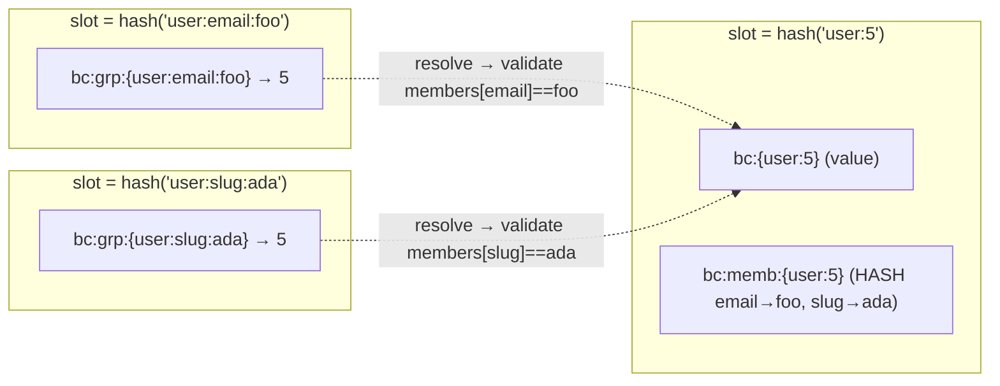

# smartcache

A small Go cache library whose one generic, type-safe `Cache[T]` does **both read-through and write-through** over a **pluggable, backend-agnostic store** — so you stop re-implementing the miss → load → populate → invalidate dance for every entity, and you can swap Redis for in-memory (or your own backend) without touching a single call site.

## Install

```bash
go get github.com/Bytonomics/smartcache
```

## Why smartcache

Most Go caching options are either a **raw store** (a Redis client, an in-memory map) that hands you `get`/`set` and leaves you to build — and repeat — the read-through, write-through, and invalidation logic at every call site, or an **in-memory-only cache** with no way to put a real backend behind the same API. smartcache is the missing middle: one primitive that owns that orchestration for you, generically and type-safely, over whatever backend you inject.

**The core value:**

- **One `Cache[T]` for both directions** — read-through (`GetByKey` + a loader) *and* write-through (`PutByKey` + a writer) in the same type-safe primitive; no `interface{}`, no manual casts.
- **Backend-agnostic** — `Cache[T]` talks only to a small `CacheStore` interface. `redisstore` and `memstore` ship in the box; anything else (an LRU, `ristretto`, `bigcache`, your own backend) is a tiny adapter, and swapping backends never changes a call site.

**Correct by default** — the choices that prevent the classic caching bugs are made for you, not left as footguns:

- **Required TTL backstop** — a value can never be cached forever by accident, so a missed or failed invalidation self-heals within a bounded window (opt into no-expiry explicitly with `AllowInfinite`).
- **Downward-only TTL jitter** — every cached value's effective TTL is shaved down by a small random amount by default, so a batch of keys written together doesn't all expire at the exact same instant and stampede the database together.
- **Delete-on-write** — writes evict rather than overwrite in place, avoiding the concurrent stale-set race.
- **A cache failure never fails your operation** — if writing to the backend fails, your `GetByKey`/`PutByKey`/`GetManyByKey` still returns the real value; the cache stays a performance layer, not a hard dependency.
- **Cache-stampede protection** — concurrent reads that miss the same key are coalesced into a single load (see below).
- **Optional negative caching** — briefly remember "not found" so repeated probes of bad or non-existent ids don't reach your database. Off by default (`NegativeTTL` has no default duration — it stays disabled until you explicitly set one).

### Cache stampede

A **cache stampede** — also called a **thundering herd** (or "dog-piling") — happens when a hot key is missing or has just expired and many concurrent requests all miss it at the same instant, so they *all* fall through to the database at once and can overwhelm it. smartcache prevents this on reads: concurrent `GetByKey` calls for the same key are coalesced so that only one runs your loader and performs the write-back, while the rest wait and share that single result. This is on by default (disable with `DisableSingleflight`). Writes are never coalesced — each `PutByKey`/`PutValue` is a distinct intended write, and `GetManyByKey`'s batched load is not coalesced across concurrent `GetManyByKey` calls either.

Background reading: [Cache stampede (Wikipedia)](https://en.wikipedia.org/wiki/Cache_stampede).

## Core Concepts

- **`Manager` + `Register`** — the only way to build a `Cache[T]`. A `Manager` holds the injected `CacheStore`, a set of default options, and (optionally) an OpenTelemetry metrics exporter; `Register[T]` creates one named `Cache[T]` on it, inheriting the manager's defaults unless you override them for that entity.
- **`CacheStore` interface** — the injected cache backend (never the application's own database). `memstore` (in-memory) and `redisstore` (go-redis) are provided; bring your own implementation for any other system.
- **Generic `Cache[T]`** — read-through `GetByKey`/`GetManyByKey` with a loader function; write-through `PutByKey` with a writer function; `PutValue` to cache a value you already hold, with no external write; `EvictByKey` and `EvictManyByKey` for delete-on-write; value-derived `Put`, `PutValue`, and `Evict` methods that derive the cache key from `val.CacheUniqueKey()`.
- **`RegisterAliasGroup` + alias groups** — an opt-in second constructor for a value reachable by several lookup keys (id, email, slug, …), where a write or delete through any one of them keeps the rest consistent — requires `T` to implement `UniqueKeyed`; pick per-cache slot placement with AliasMode (Colocated vs Sharded) for Redis Cluster — see [`RegisterAliasGroup`](#registeraliasgroup--one-value-many-lookup-keys).
- **Required positive TTL backstop** — the resolved `TTL` must be positive. Opt in to no expiry via `AllowInfinite: true`.
- **Downward-only TTL jitter** — both `TTL` and `NegativeTTL` are independently shaved down by a random fraction (default 10%, configurable, 0 disables) so keys written together don't all expire in sync.
- **Optional negative caching, off by default** — cache "not found" results for a separate duration via `NegativeTTL`. There is no built-in default duration; negative caching only activates once you set `NegativeTTL` to a positive value yourself, so its behavior is never a surprise.
- **Singleflight de-duplication** — concurrent cold loads for the same key are serialized (on by default; disable via `DisableSingleflight: true`).
- **Pluggable `Codec`** — customize serialization. JSON is the default.
- **Optional OpenTelemetry metrics** — configure `WithOTLP` on the `Manager` to export per-cache counters and a load-latency histogram, fire-and-forget on a background interval.

## Failure Semantics

- **Populate failures** — if the backend `Set` call fails after a loader runs, `GetByKey` still returns the loaded value and reports `Outcome == LoadedNotCached`. If the backend `Set` call fails after a writer runs, `PutByKey` still returns the written value and reports `Outcome == WrittenNotCached`. `GetManyByKey` applies the same rule per key. Neither the read nor the write fails — only caching the result failed.
- **Writer failures** — if `writer` returns a non-nil error, `PutByKey` returns that error unchanged and the cache is left untouched. If `writer` returns `(nil, nil)`, `PutByKey` returns `ErrNilWrite` and the cache is left untouched — the cache is never set to a nil value.
- **`GetManyByKey` load failures** — if `loadMissing` returns a non-nil error, `GetManyByKey` returns that error wrapped, with a nil result map — even the keys that were already cache hits are discarded, matching `GetByKey`'s "a failed load fails the call" behavior.
- **`GetManyByKey` batch-read failures** — if the backend's batch read fails, every requested key is treated as a miss and loaded via `loadMissing`, exactly as if none of them were cached; the batch-read failure itself never surfaces to the caller.
- **EvictByKey failures** — if a backend `Delete` call fails, the error is returned to the caller so it can retry or alert.
- **Value-derived method failures** — when using `Put(ctx, writer)`, `PutValue(ctx, val)`, or `Evict(ctx, val)`, if `T` does not implement `UniqueKeyed`, these methods return `ErrNotUniqueKeyed`.
- **TTL backstop** — the TTL bounds how long any missed or failed eviction can leave a stale value in the cache.

## Outcomes

`GetByKey`, `GetManyByKey`, and `PutByKey` each report an `Outcome` so callers can meter cache-hit rate and alert on populate failures. `GetByKey`/`GetManyByKey` never return a `PutByKey`-only outcome, and `PutByKey` never returns a `GetByKey`-only outcome — the two are read-side and write-side vocabularies, not interchangeable.

`GetByKey` and `GetManyByKey` return (or, for `GetManyByKey`, meter per key) one of:

- `Hit` — value was served from the cache (and not expired).
- `Loaded` — a miss occurred, the loader ran, and the value was cached. `GetManyByKey` also reports `Loaded` for a key confirmed not-found in the source of truth (whether or not negative caching is enabled).
- `LoadedNotCached` — a miss occurred, the loader ran, but the backend `Set` failed; the value is still returned, uncached.
- `NegativeHit` — a previously cached "not found" was served.

`PutByKey` returns one of:

- `Written` — the writer ran and the value it returned was cached.
- `WrittenNotCached` — the writer ran, but the backend `Set` failed; the value is still returned, uncached.

`PutValue`, `Put` (value-derived), and `PutValueByKey` return only an `error` — they have no `Outcome`, since they perform no external write (or no external write separate from value derivation) to characterize.

## Usage

Setup — one `Manager` and one `Cache[User]` registered on it, shared by every snippet below:

```go
import (
	"context"
	"fmt"
	"time"

	"github.com/Bytonomics/smartcache"
	"github.com/Bytonomics/smartcache/redisstore"
	"github.com/redis/go-redis/v9"
)

type User struct {
	ID   string
	Name string
}

func main() {
	rdb := redis.NewClient(&redis.Options{Addr: "localhost:6379"})
	store := redisstore.New(rdb)

	mgr, err := smartcache.NewManager(store)
	if err != nil {
		panic(err)
	}

	ttl := time.Hour
	users, err := smartcache.Register[User](mgr, "user", &smartcache.EntityOptions{TTL: &ttl})
	if err != nil {
		panic(err)
	}
	ctx := context.Background()

	// ... the snippets below continue here, using ctx and users.
}
```

### `Manager` + `Register` — the only way to build a `Cache[T]`

```go
mgr, err := smartcache.NewManager(store,
	smartcache.WithDefaultTTL(time.Hour),
	smartcache.WithDefaultNegativeTTL(30*time.Second),
)
if err != nil {
	panic(err)
}

// name is required and unique per manager: it doubles as the metric name and
// the default key prefix. EntityOptions fields are pointers: nil inherits the
// manager default, non-nil overrides it for this cache only.
teamTTL := 15 * time.Minute
teams, err := smartcache.Register[Team](mgr, "team", &smartcache.EntityOptions{TTL: &teamTTL})
if err != nil {
	panic(err)
}
```

`Register` is a **package-level generic function**, not a method on `Manager` — Go methods cannot have type parameters, so `mgr.Register[Team](...)` is not possible. `Manager.Shutdown(ctx)` flushes and stops the OTLP exporter (see [Telemetry](#telemetry--opentelemetry-metrics) below); it is a no-op when `WithOTLP` was never configured.

### `GetByKey` — read-through

```go
user, outcome, err := users.GetByKey(ctx, "u_123", func(ctx context.Context) (*User, error) {
	return loadUserFromDB(ctx, "u_123") // your own database call
})
if err != nil {
	panic(err)
}
fmt.Println(user.Name, outcome)
```

`GetByKey` checks the cache for `"u_123"` first. On a miss, it calls the loader function you passed in, caches exactly
the value the loader returned, and returns that value. On a hit, the loader is never called at all — this is what
makes repeat reads for a hot key stop touching your database. `outcome` reports which of these happened: `Hit`,
`Loaded`, `LoadedNotCached`, or `NegativeHit` — see [Outcomes](#outcomes) for what each one means.

**Signaling and detecting "not found".** To cache a "not found" — and to enable negative caching — your loader
returns `smartcache.ErrNotFound`. smartcache then reports `Outcome == Loaded` (cold) or `NegativeHit` (warm) and
returns `smartcache.ErrNotFound` to you. Any *other* error from your loader is treated as transient: it is
returned to you unchanged and is **never** cached. A caller therefore tells the two apart with
`errors.Is(err, smartcache.ErrNotFound)` — that is a definite not-found; any other non-nil error is a transient
failure. (`GetManyByKey`'s `loadMissing` signals not-found differently: simply omit the id from the returned map — see
below.)

### `GetManyByKey` — batch read-through

```go
result, err := users.GetManyByKey(ctx, []string{"u_1", "u_2", "u_3"}, func(ctx context.Context, missing []string) (map[string]*User, error) {
	return loadUsersFromDB(ctx, missing) // your own batched database call — one query for all missing ids
})
if err != nil {
	panic(err)
}
for id, user := range result {
	fmt.Println(id, user.Name)
}
```

`GetManyByKey` reads every key from the cache in one batch round trip (a Redis `MGET` when the backend supports it;
otherwise one `GetByKey` per key). Cached keys never touch your loader at all. Every key that misses is collected and
loaded in **exactly one** call to `loadMissing` — never one call per missing key — and each returned value is
cached individually. An id `loadMissing` does not return (present as a missing key in the input but absent from
its result map) is treated as confirmed not-found: it is negative-cached when `NegativeTTL > 0`, and is **never**
present in the returned map either way. Unlike `GetByKey`, `GetManyByKey` is not deduplicated via singleflight — two
concurrent `GetManyByKey` calls for overlapping missing keys may each call `loadMissing`.

### `PutByKey` — write-through

```go
newUser := &User{ID: "u_456", Name: "Ada Lovelace"}
saved, outcome, err := users.PutByKey(ctx, "u_456", func(ctx context.Context) (*User, error) {
	if err := saveUserToDB(ctx, newUser); err != nil { // your own database call
		return nil, err
	}
	return newUser, nil
})
if err != nil {
	panic(err)
}
fmt.Println(saved.Name, outcome)
```

`PutByKey` is for when the write itself should go through smartcache. It calls your `writer` function to persist the
value to your own source of truth, then caches exactly the value `writer` returned — so a `GetByKey` for `"u_456"`
right after this `PutByKey` is served from cache with no database round trip. If `writer` returns a non-nil error,
`PutByKey` returns that error unchanged and the cache stays untouched. If `writer` returns `(nil, nil)`, `PutByKey` returns
`ErrNilWrite`, because the cache is never set to a nil value. Unlike `GetByKey`'s loader, `writer` is **never**
deduplicated: two concurrent `PutByKey` calls for the same key are two distinct writes, and singleflight would
silently drop one of them. `outcome` is `Written` or `WrittenNotCached` — see [Outcomes](#outcomes).

### `PutValueByKey` — direct cache write by key

```go
if err := users.PutValueByKey(ctx, "u_456", newUser); err != nil {
	panic(err)
}
```

`PutValueByKey` writes a value you already hold straight into the cache — no external write happens, no writer
function is called. Use it when your own code already performed the real write (e.g. you just ran the `INSERT`
yourself) and you only need the cache updated to match it. `PutValueByKey` returns only an `error`; it has no
`Outcome`, since there is no external write for one to characterize.

### `EvictByKey` — delete-on-write by key

```go
// After updating the user elsewhere (e.g. via PutByKey's writer, or your own code):
if err := users.EvictByKey(ctx, "u_123"); err != nil {
	panic(err)
}
```

`EvictByKey` removes the cached entry for `"u_123"` right away. Call it after the source of truth changes outside of
`PutByKey`/`PutValueByKey`, so the next `GetByKey` for that key is a clean read-through instead of serving stale data.
`EvictManyByKey` does the same for several keys at once, joining any errors.

### Key-taking vs value-derived methods

smartcache offers two parallel method families, distinguished by how they derive the cache key:

**Key-taking methods** — explicit cache key parameter:
- `GetByKey(ctx, key, loader)`, `GetManyByKey(ctx, keys, loadMissing)` — read-through by explicit key
- `PutByKey(ctx, key, writer)`, `PutValueByKey(ctx, key, val)` — write-through by explicit key
- `EvictByKey(ctx, key)`, `EvictManyByKey(ctx, keys)` — delete by explicit key

These work for **any** `T`, including slice types, and do not require `T` to implement any interface.

**Value-derived methods** — key derived from `val.CacheUniqueKey()`:
- `Put(ctx, writer)` — write-through, derives key from result of `writer` (requires `T` implements `UniqueKeyed`)
- `PutValue(ctx, val)` — direct cache write, derives key from `val` (requires `T` implements `UniqueKeyed`)
- `Evict(ctx, val)` — delete, derives key from `val` (requires `T` implements `UniqueKeyed`)

These methods **require** `T` to implement `UniqueKeyed { CacheUniqueKey() string }`, and return `ErrNotUniqueKeyed` if it doesn't. Use value-derived methods when the cache key is a natural part of the entity itself (e.g. a user's ID). Use key-taking methods for everything else, including slice types and composite caches.

**Note**: There is **no value-derived `Get`** — reads always use `GetByKey` or `GetByAlias`, because loading a value from an external source requires the key upfront to perform the load.

### `RegisterAliasGroup` — one value, many lookup keys

```go
type User struct {
	ID    string
	Name  string
	Email string
}

func (u User) CacheUniqueKey() string { return u.ID }

users, err := smartcache.RegisterAliasGroup[User](mgr, "user", &smartcache.EntityOptions{TTL: &ttl})
if err != nil {
	panic(err)
}
```

`RegisterAliasGroup` is an alias-aware cache constructor: it builds a `Cache[T]` whose one cached value can
be reachable by several lookup keys — e.g. a user by id, by email, and by slug — where writing or deleting
through **any** key keeps the rest consistent. `User` must implement `UniqueKeyed` (one method,
`CacheUniqueKey() string`, returning its own primary cache key; the key may be composite, e.g. `"provider:subscriptionID"`); `RegisterAliasGroup` panics at startup — not at
first use — if `User` doesn't implement it, or if the injected `CacheStore` doesn't support alias groups. Both
bundled stores, `memstore` and `redisstore`, support alias groups. Plain `Register` does **not** require `UniqueKeyed`, so slice types and other composites can be cached with `Register`.

### `PutAliased` / `PutAliasedValue` — register an alias

```go
_, _, err = users.PutAliased(ctx, "u_123", smartcache.AliasRef{Field: "email", Value: "ada@example.com"},
	func(ctx context.Context) (*User, error) {
		return loadUserFromDB(ctx, "u_123")
	})
```

`PutAliased` is `PutByKey`'s alias-aware counterpart — it runs your writer and registers the given alias for the
result, so a later `GetByAlias` finds it. `PutAliasedValue` is `PutValueByKey`'s counterpart: it registers an alias
for a value you already hold, with no writer call. Call either once per alias, as your code first needs each
lookup path. A field holds at most one value per record: registering `email` again for the same primary
replaces the old one, and if that email was already registered to a *different* primary, it is moved rather
than shared.

### `GetByAlias` — read-through by alias

```go
user, outcome, err := users.GetByAlias(ctx, smartcache.AliasRef{Field: "email", Value: "ada@example.com"},
	func(ctx context.Context) (*User, error) {
		return loadUserByEmailFromDB(ctx, "ada@example.com")
	})
```

`GetByAlias` is `GetByKey`'s alias-aware counterpart. On a hit it resolves the alias straight to the value, same as
`GetByKey`. On a miss it runs your loader, reads the loaded value's `CacheUniqueKey()`, and registers this alias for
it automatically — so a first-ever login by email warms the cache exactly like a first `GetByKey` by id would.

### `EvictByAlias` — delete-on-write by alias

```go
if err := users.EvictByAlias(ctx, smartcache.AliasRef{Field: "email", Value: "ada@example.com"}); err != nil {
	panic(err)
}
```

`EvictByAlias` is `EvictByKey`'s alias-aware counterpart: deleting through an alias removes the value and **every**
alias for it, exactly as deleting through the primary key does — so no lookup path is left pointing at stale or
deleted data. There is no separate "update by alias" method: a primary `PutByKey`/`PutValueByKey` already updates every
alias's view.

### Slot placement: `AliasColocated` vs `AliasSharded`

An alias-group cache chooses one of two Redis-Cluster slot-placement strategies via
`EntityOptions.AliasMode` (default `AliasColocated`). The public API is identical in both modes;
only slot placement, hop count, and cross-key atomicity differ.

| | `AliasColocated` (default) | `AliasSharded` |
|---|---|---|
| slot granularity | one slot per **entity** (`{ns}`) | one slot per **record** + per **alias** |
| `GetByAlias` | 1 atomic Lua | 2 hops (resolve → validate-on-read) |
| write / evict | 1 atomic Lua cascade | record-slot atomic Lua + best-effort pointer ops |
| atomicity | full single-Lua cascade | record atomic; pointers best-effort, self-healing |
| stale reads | none | none (validate-on-read) |
| Cluster hotspot | **yes — one slot per entity** | **no** |
| best for | single-instance Redis, or small / low-traffic entities | Cluster with any large / hot entity |

Rule of thumb: **single-instance Redis → `AliasColocated`; Cluster with any hot or large entity →
`AliasSharded`.** `AliasColocated` is still *correct* on a Cluster — it just concentrates that
entity's traffic on one node.

```go
mode := smartcache.AliasSharded
users, _ := smartcache.RegisterAliasGroup[User](mgr, "user", &smartcache.EntityOptions{
    TTL:       &ttl,
    AliasMode: &mode,
})
```

`AliasColocated` — the whole `user` entity lives on one slot:



`AliasSharded` — the record and each alias land on independent slots:



### TTL jitter

```go
fraction := 0.10 // default; 0 disables jitter for this cache
users, err := smartcache.Register[User](mgr, "user", &smartcache.EntityOptions{
	TTL:             &ttl,
	JitterFraction:  &fraction,
})
```

Every positive and negative TTL is shaved down — never extended — by a random amount up to `JitterFraction` of
the base TTL before being applied on a cache `Set`. This means a large batch of keys written around the same
time (e.g. warming a cache on deploy) does not all expire at the exact same instant and cause a synchronized
cache stampede when they do. The configured TTL always remains a hard upper bound on staleness; jitter only ever
shortens it. Set `JitterFraction: ptrFloat64(0)` to disable jitter for a specific cache, or
`smartcache.WithDefaultJitterFraction(0)` on the `Manager` to disable it everywhere.

### Telemetry — OpenTelemetry metrics

```go
url := "localhost:4317"
mgr, err := smartcache.NewManager(store, smartcache.WithOTLP(smartcache.OTLPConfig{
	URL: &url, // required; every other field is optional with a sensible default
}))
if err != nil {
	panic(err)
}
defer func() { _ = mgr.Shutdown(context.Background()) }()
```

When `WithOTLP` is configured, every cache registered on the manager gets its own set of counters —
`smartcache.<name>.hit`, `.loaded`, `.loaded_not_cached`, `.negative_hit`, `.load_error`, `.written`,
`.written_not_cached`, `.evict` — plus a `smartcache.<name>.load_latency` histogram (seconds), exported over OTLP
gRPC on a background interval (default 15s), fire-and-forget. Metrics are never labeled by cache key — only by
the cache's registered name — so cardinality stays bounded regardless of traffic. Call `Manager.Shutdown` on
process exit to flush the final batch; it is a no-op when `WithOTLP` was never configured, so callers that don't
need metrics pay no lifecycle cost.

## Configuration

Every option is set at one of two levels: on the **manager** (a default inherited by every cache it builds), or
on an **individual cache** at `Register` time (which overrides the manager default for that one cache). Per-cache
options are pointers — a `nil` field inherits the manager default; a non-nil field overrides it.

### Manager options — `NewManager(store, ...ManagerOption)`

| Option | Sets | Default when the option is omitted |
|---|---|---|
| `WithDefaultTTL(d)` | Default positive TTL for caches that do not set their own | `0` — unset; each cache must then set `TTL` or `AllowInfinite`, or `Register` returns `ErrInvalidTTL` |
| `WithDefaultJitterFraction(f)` | Default downward TTL-jitter fraction | `0.10` |
| `WithDefaultNegativeTTL(d)` | Default negative-cache TTL | `0` — negative caching off |
| `WithDefaultDisableSingleflight(b)` | Default singleflight toggle | `false` — singleflight **on** |
| `WithDefaultCodec(c)` | Default serialization codec | `nil` → JSON |
| `WithOTLP(cfg)` | Turn on OpenTelemetry metric export | not set — metrics disabled |

### `OTLPConfig` — the value passed to `WithOTLP`

Pointer fields; a `nil` field uses the default shown.

| Field | Type | Default |
|---|---|---|
| `URL` | `*string` | **required** — `WithOTLP` returns an error if nil; no default |
| `FlushInterval` | `*time.Duration` | `15s` |
| `Timeout` | `*time.Duration` | `10s` |
| `Insecure` | `*bool` | `false` (TLS) |
| `ServiceName` | `*string` | `"smartcache"` |

### Per-cache options — `EntityOptions` in `Register[T](mgr, name, opts)`

Pointer fields; `nil` inherits the manager default, non-nil overrides it.

| Field | Type | Default when nil |
|---|---|---|
| `Prefix` | `*string` | the registered `name` |
| `TTL` | `*time.Duration` | manager default TTL (`0` unless `WithDefaultTTL` set); `TTL <= 0` without `AllowInfinite` → `ErrInvalidTTL` |
| `AllowInfinite` | `*bool` | `false` (per-cache only — there is no manager-level default) |
| `JitterFraction` | `*float64` | manager default (`0.10` unless changed); `0` disables jitter; must be in `[0, 1)` or `Register` returns `ErrInvalidJitterFraction` |
| `NegativeTTL` | `*time.Duration` | manager default (`0` = negative caching off) |
| `DisableSingleflight` | `*bool` | manager default (`false` = singleflight on) |
| `Codec` | `Codec` | manager default codec, else JSON |

`name` (the second argument to `Register`) is required and unique per manager: an empty name returns
`ErrEmptyName`, a duplicate returns `ErrDuplicateName`. Registering a pointer type (`Register[*T]`) panics with
`ErrPointerType`.

## Examples

Runnable, end-to-end examples live in [`examples/`](./examples), demonstrating every method above — `GetByKey` (miss
then hit), negative caching, `PutValueByKey`, `PutByKey`, `GetManyByKey`, and `EvictByKey` — against both backends:

```bash
cd examples
make deps   # first time only — downloads examples' own dependencies

# No infrastructure needed:
make run-memstore

# Needs a local Redis:
docker run --rm -p 6379:6379 redis:7
make run-redisstore
```

`examples` is its own Go module (own `go.mod`/`go.sum`, `replace`d to the local checkout) so trying things out —
or adding a new example with its own dependencies — never touches the root module's dependency graph.

## Implementation Notes

The backend is an interface, so any store — or a fake, for tests — can replace Redis or in-memory storage without touching call sites. The optional OpenTelemetry metrics exporter (see [Telemetry](#telemetry--opentelemetry-metrics)) means every consumer of this module — even one that only uses the in-memory `memstore` and never configures `WithOTLP` — pulls the OpenTelemetry API and SDK as a dependency; this is a deliberate trade-off for a zero-friction "just pass an endpoint" telemetry story.

### Shared values under singleflight

When singleflight is enabled (the default), a `GetByKey` call that returns `Loaded` or `LoadedNotCached` may hand back
the exact same `*T` given to every other concurrent caller deduped onto that same loader call — this is
`singleflight.Do`'s own contract: all duplicate callers receive the one result the leader produced. Treat a
`Loaded`/`LoadedNotCached` result as read-only; copy it before mutating. A `Hit` result is different: `GetByKey`
unmarshals a fresh value from the cache on every call, so it is never shared with another caller.

### The `CacheStore` interface

To back `Cache[T]` with your own storage system, implement `CacheStore`:

```go
type CacheStore interface {
	// Get returns the raw bytes for key, or ErrStoreMiss if the key is absent.
	Get(ctx context.Context, key string) ([]byte, error)
	// Set stores val under key with the given ttl. A ttl <= 0 means no expiry.
	Set(ctx context.Context, key string, val []byte, ttl time.Duration) error
	// Delete removes key. Deleting an absent key is not an error.
	Delete(ctx context.Context, key string) error
	// Exists reports whether key is present (and not expired).
	Exists(ctx context.Context, key string) (bool, error)
}
```

`Cache[T]` owns all serialization — `CacheStore` only ever sees raw bytes, never the cached type `T`. Pass your
implementation to `smartcache.NewManager(store, ...)` in place of `memstore.New()` or `redisstore.New(rdb)`.

Optionally, also implement `BatchCacheStore` (embeds `CacheStore` and adds one `GetMany(ctx, keys) (map[string][]byte, error)` method) so `Cache[T].GetManyByKey` can read several keys in a single round trip instead of falling back to one `GetByKey` call per key. `redisstore` implements it via Redis `MGET`; `memstore` implements it with an in-process loop.

### `AliasCacheStore` — backing `RegisterAliasGroup`

To back an alias-group cache (see [`RegisterAliasGroup`](#registeraliasgroup--one-value-many-lookup-keys)) with your own
storage system, implement `AliasCacheStore` in addition to `CacheStore`. It is a factory: given the cache's
namespace and slot-placement mode, it returns an `AliasOps` handle that owns all key math and grouped
operations for that cache:

```go
type AliasMode int

const (
	AliasColocated AliasMode = iota // one Cluster slot per entity; single atomic Lua per op. Default.
	AliasSharded                    // distributed per record/alias; validate-on-read.
)

type AliasRef struct {
	Field string
	Value string
}

type AliasOps interface {
	GetValue(ctx context.Context, primary string) ([]byte, error)
	PutValue(ctx context.Context, primary string, val []byte, ttl time.Duration) error
	EvictByPrimary(ctx context.Context, primary string) error
	GetByAlias(ctx context.Context, ref AliasRef) ([]byte, error)
	PutByAlias(ctx context.Context, primary string, ref AliasRef, val []byte, ttl time.Duration) error
	EvictByAlias(ctx context.Context, ref AliasRef) error
}

type AliasCacheStore interface {
	CacheStore
	AliasGroup(ns string, mode AliasMode) AliasOps
}
```

`RegisterAliasGroup` detects `AliasCacheStore` the same way `Cache[T].GetMany` detects `BatchCacheStore` — a
type assertion at registration time, so a store that doesn't implement it simply can't be used with
`RegisterAliasGroup` (see the [Error reference](#error-reference) for the resulting panic). `redisstore` ships
both a `AliasColocated` and an `AliasSharded` implementation; `memstore` ships a single mode-agnostic
implementation (a single process has no Cluster slots to distribute across, so mode doesn't affect its
behavior). The mode is chosen per cache via `EntityOptions.AliasMode` (`nil` defaults to `AliasColocated`) and
is fixed for the cache's lifetime. See [`docs/1-alias-cache-design.md`](./docs/1-alias-cache-design.md) for the
full design, including the trade-offs between the two modes.

### Custom serialization (`Codec`)

By default `Cache[T]` serializes values as JSON. To use a different encoding — for speed, a compact binary
format, compression, or encryption-at-rest — supply a `Codec`, either per cache (`EntityOptions.Codec`) or as a
manager default (`WithDefaultCodec`):

```go
type Codec interface {
	Marshal(v any) ([]byte, error)
	Unmarshal(data []byte, v any) error
}
```

A compressing or encrypting codec simply wraps another: on `Marshal`, encode then compress/encrypt the bytes; on
`Unmarshal`, decrypt/decompress then decode. This is how "compressed" and "encrypted-at-rest" cached values are
achieved with no change to smartcache itself.

### Adapting another cache library

To back `Cache[T]` with any existing Go cache (an LRU, `ristretto`, `bigcache`, `patrickmn/go-cache`, …), write a
small adapter type that implements `CacheStore` by calling into that library — the same pattern `memstore` and
`redisstore` already use. `Get` must return `ErrStoreMiss` (not the underlying library's own miss value) so
`Cache[T]` recognizes it as a read-through miss.

## Outcome reference

`GetByKey`, `GetManyByKey`, and `PutByKey` return an `Outcome` (an `int` enum with a `String()` method) describing how the call
was served. `GetByKey`/`GetManyByKey` use the read-side values; `PutByKey` uses the write-side values; the two never mix.

| Outcome | Reported by | Meaning |
|---|---|---|
| `Hit` | `GetByKey`, `GetManyByKey` | Served from the cache (present and not expired). |
| `Loaded` | `GetByKey`, `GetManyByKey` | A miss occurred, the loader ran, and the value was cached. `GetManyByKey` also reports `Loaded` for a key confirmed not-found in the source. |
| `LoadedNotCached` | `GetByKey`, `GetManyByKey` | A miss occurred and the loader ran, but the backend `Set` failed; the value is still returned, uncached. |
| `NegativeHit` | `GetByKey`, `GetManyByKey` | A previously cached "not found" was served. |
| `Written` | `PutByKey` | The writer ran and the value it returned was cached. |
| `WrittenNotCached` | `PutByKey` | The writer ran, but the backend `Set` failed; the value is still returned, uncached. |

`PutValueByKey`, `Put`, `PutValue`, `EvictByKey`, and `EvictManyByKey` return only an `error` — they have no `Outcome`.

## Error reference

All sentinels are exported from the `smartcache` package; check them with `errors.Is`. `ErrPointerType` and `ErrAliasingNotSupported` are the
only ones that **panic** (programming errors caught at construction) rather than being returned.

| Sentinel | Raised by | When |
|---|---|---|
| `ErrNotFound` | `GetByKey` / `GetManyByKey` return it; your loader returns it | A cacheable "not found". Your loader returns it to mark a not-found (this is what enables negative caching); `GetByKey` returns it to you. Detect with `errors.Is(err, smartcache.ErrNotFound)`. |
| `ErrNilWrite` | `PutByKey` (returned) | The writer returned `(nil, nil)`; the cache is never set to a nil value. |
| `ErrNotUniqueKeyed` | `Put` / `PutValue` / `Evict` (returned) | `T` does not implement `UniqueKeyed`, but a value-derived method was called. |
| `ErrInvalidTTL` | `Register` (returned) | The resolved `TTL <= 0` and `AllowInfinite` is false. |
| `ErrInvalidJitterFraction` | `Register` (returned) | The resolved jitter fraction is outside `[0, 1)`. |
| `ErrEmptyName` | `Register` (returned) | The cache name is empty. |
| `ErrDuplicateName` | `Register` (returned) | A cache with that name is already registered on the manager. |
| `ErrPointerType` | `Register` / `RegisterAliasGroup` (**panics**) | `T` is itself a pointer type (e.g. `Register[*User]`) — a programming error, caught at construction. |
| `ErrNilStore` | `NewManager` (returned) | The `CacheStore` passed to `NewManager` is nil. |
| `ErrAliasingNotSupported` | `RegisterAliasGroup` (**panics**) | The injected `CacheStore` doesn't support alias groups. |
| `ErrNotAliasGroup` | `GetByAlias` / `PutAliased` / `PutAliasedValue` / `EvictByAlias` (returned) | Called on a cache built with `Register` instead of `RegisterAliasGroup`. |
| `ErrStoreMiss` | `CacheStore.Get` (backend contract) | The key is absent. A backend's `Get` returns it and `Cache[T]` treats it as a miss; it is never surfaced to callers. Relevant only when writing a custom backend. |

## License

MIT
